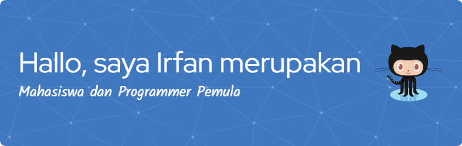

<!--
**irfansap01/irfansap01** is a ✨ _special_ ✨ repository because its `README.md` (this file) appears on your GitHub profile.

Here are some ideas to get you started:

- 🔭 I’m currently working on ...
- 🌱 I’m currently learning ...
- 👯 I’m looking to collaborate on ...
- 🤔 I’m looking for help with ...
- 💬 Ask me about ...
- 📫 How to reach me: ...
- 😄 Pronouns: ...
- ⚡ Fun fact: ...
-->

- Pronouns: He/Him
- How to reach me:
  - Linkedin:
    [@irfansaputranst](https://www.linkedin.com/in/irfansaputranst/)
  - Pinterest: [Irfan Saputra Nasution](https://id.pinterest.com/irfansaputranst/)
  - Behance: [@irfansaputra5](https://www.behance.net/irfansaputra5)

---

Hi, I'm Irfan Saputra Nasution

With 5+ years in the creative industry, I've mastered the art of visual storytelling across education, e-commerce, and digital media. As a social media specialist for a university and freelance content creator for PT. Sunset Global Indonesia, I've developed a sharp eye for design and a strategic approach to content that engages audiences. My work ranges from product photography to comprehensive social media campaigns, always with a focus on quality and impact.

Currently leading the creative team at Creasnap, I oversee content creation while ensuring every project aligns with brand identities and marketing goals. I thrive on transforming concepts into compelling visuals, whether it's through graphic design, photography, or strategic content planning. My strength lies in blending creativity with analytics to create work that's not just beautiful, but effective.

Beyond pixels and layouts, I'm passionate about the psychology of design and how visuals influence perception. I continuously explore new techniques and trends to keep my work fresh and relevant. Let's connect and create something memorable together!

# My Github Stats and Programming Language

 

 

# Skill

<table border="1px solid black" style="margin: 0; width:625px">
<tr>
<td>
<b style="font-size:30px">I have</b>
</td>
<td>
<b style="font-size:30px">I’m learning</b>
</td>
</tr>
<tr>
<td>

</td>
<td>
  
</td>
</tr>
</table>

 
 
